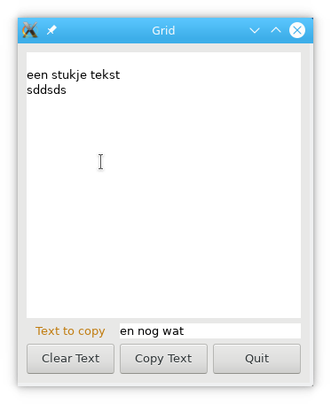

# State diagram design ui and run

```plantuml
'title Design and use of code
hide empty description

skinparam state {
  BackgroundColor<<file>> #ff8800
  BorderColor<<file>> #555555
}


state "xyz.ui" as gladeFile <<file>>
state "xyz.pm6" as perlModule <<file>>
state "GTK::Glade.pm6" as perlLibModule <<file>>


'[*] --> Prepare
state "Preparation of\ncode and data" as Prepare {

  Design: Design user interface\nusing glade and\nsave ui description
  Design --> gladeFile: save

  Design -> P6Code: user\naction
  P6Code --> perlModule: save
  P6Code: Perl6 Engine class\nwith methods for all\ndefined signals

  'P6Code -> [*]
}

[*] --> Design: user\naction


state "Perl6 program" as P6CodeFlow {
  state "GTK::Glade" as GTKGlade
  state "GTK::Glade::Engine" as Engine

  '[*] -> Engine
  perlLibModule --> GTKGlade: "use GTK::Glade;"
  gladeFile --> GTKGlade: ":file('xyz.ui')"
  perlModule --> Engine: "use xyz;"
  Engine -> GTKGlade: ":engine($obj)"
  'GTKGlade -> [*]: Exit main\nloop
}

Prepare --> P6CodeFlow: Start\nprogram
'P6CodeFlow --> [*]
GTKGlade --> [*]: Exit main\nloop
```

# Example glade design


To design a state layer over this design I first study how it follows this ui. The relevant widgets have the following id's; `inputTxt`, `outputTxt`, `quitBttn`, `copyBttn` and `clearBttn`.

```plantuml
hide empty description

state "Start state\nof program" as start

[*] --> start
start --> clear: clearBttn\npressed
clear: get outputTxt button widget
clear: get text buffer from widget
clear: empty buffer
clear --> start

start --> copy: copyBttn\npressed
copy: get inputTxt button widget
copy: get text buffer from widget
copy: get text from buffer and empty buffer
copy: get outputTxt button widget
copy: get text buffer from widget
copy: append input text to output text
copy: set buffer to new text
copy --> start

start --> quit: quitBttn\npressed

quit --> [*]
```
